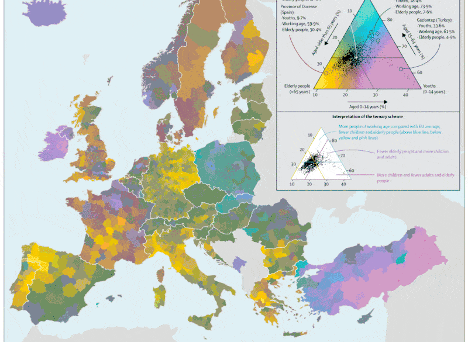

But Why? Design choices made while creating "Regional population structures at a glance"
================
Jonas Schöley & Ilya Kashnitsky

Code and data repository for [Schöley, J. & Kashnitsky, I. But Why? Design choices made while creating "Regional population structures at a glance". New Generations in Demography, Oeconomica Publishing House, 2019.](https://oeconomica.vse.cz/wp-content/uploads/page/15835/EBOOK_New-Generations-in-Demography.pdf).

