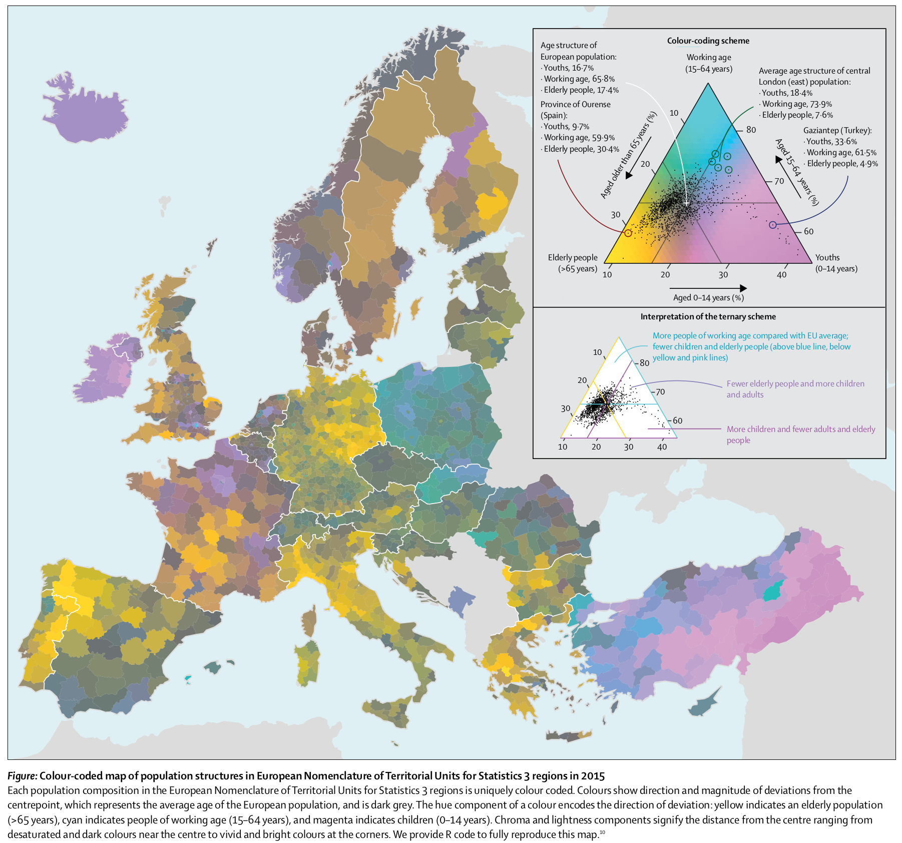

*This article has been published in [Schöley, J. & Kashnitsky, I. But Why? Design choices made while creating "Regional population structures at a glance". New Generations in Demography, Oeconomica Publishing House, 2019.](https://oeconomica.vse.cz/wp-content/uploads/page/15835/EBOOK_New-Generations-in-Demography.pdf)*

*Figures in this article can be reproduced using the code available at [github.com/jschoeley/but_why](https://github.com/jschoeley/but_why).*

In the days following the publication of "Regional population structures at a glance" [@Kashnitsky2018] we were busy participating in the discussions of our article's main figure (reproduced in Fig. 1) on social media. Various groups were sharing their thoughts on the colorful map of Europe showing the population age-structure on a regional level publicly discussing topics like European immigration, abortion legislation in Ireland, Italy's low fertility, East-West migration in Germany and more. Meanwhile designers and visualization researchers debated the question "clever or too clever?". The hundreds of comments we received post-publication gave us plenty of opportunity to reflect on our design. In this essay we want to explain the design choices we made during the creation of the map, explore and discuss alternative designs and evaluate our visualization against the goals we had when starting this project. But first let’s take a look at the map in question:

In the year 2015 Europe's population was composed of 16.7% youths (ages 0-14), 65.8% working age (ages 15-64) and 17.4% elderly (65 years and above). The age structure of any given region however may differ substantially from the European average. Fig. 1 shows those regional deviations by the means of a (centered) ternary color scale: Regions close to the European average show as dark shades of grey, e.g. the Czech Republic or the south of Spain. The further a regions age structure deviates from the aggregate age structure, the brighter and more vivid it is colored with the hue of the color indicating the direction of deviation: Yellowish regions have a larger share of elderly, e.g. Eastern Germany or the north of Spain; pinkish regions are comparatively young and blueish regions have a larger than average share of working-age population.

Important choices in the design of this visualization were the use of a ternary color coding scheme, the expression of regional age structure as a deviation from the European average, the use of continuous colors and the use of an equal-area map projection (vs. a cartogram). In the following we will explain these choices and demonstrate alternatives. The direct quotations spread throughout the text are taken from discussions of our map on social media.

But why ternary color-coding?
-----------------------------

> *"The design took me a second to get used to but now I’m a fan."*
>
> Simon Kuestenmacher (\@simongerman600), July 24, 2018

> *"Might be a red flag when your legend needs a legend."*
>
> Will Morris (\@willmorris), July 25, 2018

Ternary diagrams are not widely used outside the fields of compositional data analysis, chemistry and geology -- using a color coded ternary diagram as a legend for a map is mostly unheard of^[For earlier examples of such maps see @Brewer1994, @Dorling2012 (the corresponding PhD thesis was published in 1992), and @Schoeley2017.] and makes for a true xenograph [@Lambrechts2019], i.e. a visualization that most viewers are completely unfamiliar with. So why did we choose such a weird technique, what did we achieve and what could we have done instead?

Our design process was informed by two overarching goals and one technical limitation:

1. make people understand how European regions differ in their age structures,
2. reach a wide audience, and
3. do it in a single plot^[Due to "The Lancet" only allowing a single plot for submitted letters.].

*Reach a wide audience:* We knew that we had interesting data in our hands. Regional age-structures compared to the European average show very clear spatial patterns and provide a snapshot of the state of the demographic transition in Europe. The data has the potential to inform the public debate about population ageing in Europe -- a debate that all too often simply invokes the image of an ageing continent without addressing the regional diversity of the demographic transition.

But having interesting data is not enough to catch people‘s attention – using a novelty viz-technique which shows clear global patterns at first sight as well as local detail may however successfully engage users [@Hullman2011]. We had some prior experience using the ternary color scale [@Schoeley2017] and found that it was a technique well suited to get the interest of fellow academics who, after a short introduction, were able to correctly infer information from the plot. So yes, we were both aware of the flashiness of ternary color-coding and capitalized on this very property to arrive at our secondary design goal. However, we wouldn't have chosen the ternary color coding technique if we found it to be ineffective at conveying information.

Make people understand (in a single plot): Upon seeing the first crude version of our ternary color map (a playful experiment at this point) we were amazed by the sheer number of clearly visible spatial patterns, all of which related to meaningful differences in the underlying data. This good result was unexpected. Using color mixtures to represent multivariate data has experimentally been shown to be ineffective in situations where it is important to make accurate judgements about the numeric value of the involved quantities [@Wainer1980]. The main reason for that is the inability of people to separate a mixed color into their primary components, which is compounded by the difficulty of reading exact values from color encodings of even univariate data [@Ware1988a]. Luckily, exact quantitative judgements about the separate parts of the composition aren't at all necessary in order to achieve our first design goal, rather, the task of understanding the regional age-structure patterns is one of *similarity judgements* (which regions look similar, which look different), *nominal judgements* (does a region have more old, more young or more working age compared to the average), and *ordinal judgements* (among two regions, which is further away from the average), all of which can be performed effectively without requiring the impossible feat of primary decomposition.

### Similarity judgements

> *"I'm surprised at the drastic difference between neighboring countries (e.g. Poland/Germany) I would have expected a more gradual transition"*
>
> LockRay July 23, 2018

A basic principle when using color for data visualization is that similar colors should represent similar data and colors perceived as dissimilar should represent dissimilar data [e.g. @Silva2011]. Being guided by this simple rule a reader will be able to tell that East- and West-Germany feature greater similarities in their age structure then Turkey and Poland. This is because the color-coding technique we used assigns colors based on the magnitude and direction of deviation of a regional age structure from the European average. Regions which differ from the European average by similar degrees and in similar parts of the composition will feature similar colors. @Ware1988 found that a multidimensional color encoding allows for such similarity judgements^[They tested whether subjects were able to identify clusters based on color similarity in a multidimensional data set.].

### Nominal judgements

> *"Why is Ireland so young?[...]"*
>
> drodrey July 23, 2018

In order to make qualitative statements about a region's age-structure one simply needs to recognize the meaning of three colors: Yellowish colors mark a higher share of elderly people compared to the European average, blueish colors mark regions with a comparatively large share of working age population and pink regions mark relatively youthful regions. Reading the plot like this allows to correctly identify features such as the comparatively high share of working age population in Poland as opposed to the high share of elderly in Germany. By using unique and distinct hues for each of the three directions of compositional deviation from the average we ensured that the ternary-balance scheme can be understood as a simple categorical color scale which is known to be an effective encoding for nominal data [e.g. @Ware2013; @Munzner2015].

### Nominal-Ordinal judgements

> *"I‘m wondering if the old East Germany thing is a side effect of the wall coming down."*
>
> PoorEdgarDerby July 23, 2018

The next level of understanding would be to recognize the significance of chroma and brightness: The closer a regions age structure is to the European average the darker and grayer it is colored. Using the chroma/brightness cue one can see that former East Germany deviates more from the European average than former West Germany and that while both Ireland and East Turkey have a young population, it is the Turkish population that deviates further from the European average. Regions in the Czech Republic and the south of Spain are quite representative of the European average in terms of their three component age structure. @Burns1988 have shown that brightness and chroma are effective ordinal encodings even if hue is varying.

### Alternative encodings

> *"[...] I'm struggling a bit with the intermediate colors. I would have preferred three maps with each of the variables in their own monochrome scale."*
>
> Bo Schwartz Madsen (\@BoSchwartz) July 25, 2018

How does the ternary color-coded map fair when compared with a more conventional encoding? We pick up the suggestion above to show the three components of the composition in separate maps. As we are interested in deviations from the average European age structure, we use divergent color scales with a mid-point centered on the European share of the respective age-group.

![**Figure 2. Instead of showing the deviations of a three-part composition from some average in a single map using the ternary-balance-scheme one can also show the deviations for each part on a separate map. This way it's easier to judge patterns relating to any single part of the composition but arguably harder to make holistic statements about the three-part composition. Source: Authors; Data: Eurostat, Population on 1 January 2015 by broad age group, sex and NUTS 3 region (table "demo_r_pjanaggr3").**](assets/divergent.png)

Sadly, a small-multiples map as shown in Fig. 2 was out of the question as the publication format limited us to a single figure. A big strength of the repeated maps is the perfect separability of the three compositional components. This facilitates analytic judgements about each of the age-groups in separation from the others. On the other hand, holistic judgements about the joint three-part composition (representative/non- representative of European average, type of deviation from average) may be harder to make because they require the integration of information from all three maps.

> "Interesting approach with the ternary color scale, but I can't decide if 'clever' or 'too clever'. [...]"
>
> Moritz Stefaner (\@moritz_stefaner) July 25, 2018

![**Figure 3. The color and orientation of a line encode the direction of deviation of a region's age structure from the European average: orange and forward leaning means more young, purple and backward leaning more old and pink horizontals represent more people in working ages. Two line symbols may be combined in a case where two groups have a higher than average representation. The magnitude of deviation from the average is encoded via line length and width with longer lines representing larger deviations.**](assets/moritz.png)

Shortly after publication our map caught the interest of German information visualization designer [Moritz Stefaner](http://moritz.stefaner.eu/). He initiated a discussion among viz-professionals and researchers regarding the effectiveness of our ternary color-coding. A consensus emerged that the color encoding we used does not allow for accurate numeric estimates of the data at display. An interesting alternative, using line symbols, is shown in Fig. 3. The superimposed lines can indeed easily be judged separately and line length is known to be an accurate visual encoding [@Cleveland1986]. Crossed lines are but one among many alternative solutions proposed by famous cartographer [@Bertin2010, first edition 1967] for the problem of mapping multivariate data. Unfortunately, we did not explore these solutions. It would be interesting to compare the ternary balance scheme against these alternatives not only with regards to accuracy but also with regards to the nominal and ordinal judgement tasks stated above.

But why show deviations from an average?
----------------------------------------

> *"[...] Arguably only representing the differences in a trivariate rep. obscures the data more by obfuscating the underlying data.[...]"*
>
> Danielle Szafir (\@dalbersszafir) July 26, 2018

![**Figure 4. Europe's age compositions naturally is highly skewed towards the broadest age-group 15--65. Due to this narrow clustering using a regular ternary balance scheme (as seen on the left) makes it impossible to gain any insight into the regional variability of population structures. In order to see the internal variation of the data we shifted the grey-point of the ternary color scheme to the location of the average European age structure, thereby visualizing deviations from that average. Source: Authors; Data: Eurostat, Population on 1 January 2015 by broad age group, sex and NUTS 3 region (table "demo_r_pjanaggr3")**](assets/centering.png)

A central question in data analysis is "compared to what?", e.g. does Poland have a high life-expectancy (compared to Russia, compared to other EU members, compared to other former Warsaw-Pact member states, compared to pre-1990 etc.). Changing the point of reference changes the question. Some visualization techniques implicitly define the comparison to take place: In case of the standard ternary balance scheme (Fig. 4 left) lightness and hue encode the magnitude and direction of deviation from a perfectly balanced composition. The resulting map is of little help, showing only that the age structure of every European region is far from balanced and skewed towards the working ages. By moving the grey-point of the ternary color scale from the location of perfect balance to the location of the average age structure in Europe in 2015, we change the comparison and research question to something much more interesting: How does the age structure of a region deviate from the European average?^[We call this technique the "centered ternary balance scheme".]

But why continuous colors?
--------------------------

> *"I have the impression that the 6 discrete color scheme shown on the lower legend would have already sufficed, and possibly make the figure clearer."*
>
> Selim Onat (\@sel_onat) July 25, 2018

Selim Onat had a great idea on how to make the map more approachable: use only 6 colors. The resulting conventional choropleth map will be more familiar to the audience with the added advantage that each of the 6 colors represents a distinct and clear situation. Consequence of such a stark discretization though is a complete loss of subtlety and detail. Ireland, according to the discrete map, is just as young as Eastern Anatolia. Of course, other discretization schemes are possible but they all require a balancing act between clarity and detail. We opted for maximum detail.

![**Figure 5. The six color scheme makes the map easier to understand as discrete color scales are widely used to encode qualitative information. The downside of this simplification is the introduction of substantial quantization bias. Compositional gradients become invisible, the age-structure of Eastern Anatolia and Ireland become indistinguishable while similar regions in Germany are assigned highly contrasting colors. Source: Authors; Data: Eurostat, Population on 1 January 2015 by broad age group, sex and NUTS 3 region (table "demo_r_pjanaggr3").**](assets/discrete.png)

But why no cartogram?
---------------------

> *"Be careful over-interpreting this! Like all data maps, it emphasizes large rural provinces and de-emphasizes cities. [...] A lot of what we're seeing here is differences in urbanism and youth mobility rather than age."*
> 
> agate_ July 23, 2018

> *"[...] I actually thought that was the most interesting thing about the map -- London as a spot of youthfulness in a wider landscape of middle aged-to-elderly folk is probably actually a pretty accurate and telling feature of the UK [...]"*
>
> -burrito- July 23, 2018

Whenever maps depict relative quantities like rates or, in our case, shares of a whole, information about the size of the affected population is lost. Instead attention is drawn to large, sparsely populated areas. This bias is very relevant for maps of the European continent given that more than half of the territory of the European Union is uninhabited and roughly 3/4 of the EU's population is concentrated in less than 6% of its area [@EU2016]. In consequence our map of European age structures over-represents sparse rural populations (e.g. large parts of Scandinavia) and under-represents the urban majority (e.g. London, Berlin, Paris etc.) -- this bias can be corrected by using the cartogram technique.

Population cartograms distort geography in such a way that regions with equal population counts occupy the same area on a map [@Dougenik1985]. Compared to a regular map of Europe a cartogram pulls attention away from the rural regions towards the densely populated urban centers as illustrated by the cartogram version of our age-structure map in Fig. 6: The shrunken regions of Scandinavia, rural France & Spain and Eastern Europe are balanced by magnified urban centers such as Paris, Berlin, Rome and Ankara.

> *"There are places I'll remember // All my life, though some have changed"*
>
> The Beatles 1965

Geography is personal. On a world-map we can locate the places we and our family and friends have lived and worked, the places we have visited, and places we have heard stories about. This makes statistical maps a very engaging form of data visualization. Showing regional level data for a whole continent gives the audience the opportunity to learn about places they care about -- but only if they can locate them. The redrawn geography of a cartogram, while being the defining feature, is also its biggest drawback. With familiar coastlines being distorted and the space between capitals squashed and stretched orientation on a cartogram is no easy feat: note the difficulty in recognizing the outlines of East Germany, Wales or Austria, also, where is London? Because we wanted the audience to recognize places of interest on the map we opted against the use of a cartogram. Also, we felt that having to explain the relatively unfamiliar cartogram technique in addition to the ternary balance scheme would probably overstretch the audience's patience.

What worked, what didn't?
-------------------------

> *"I find it amazing that there are such clear differences between regions. You could almost take away the national borders and still clearly know where they are."*
>
> kenbw2 July 23, 2018

> *"Wow! Heaps of „Elderly“ across Europe!"*
>
> Rene Heim (\@ReneHJHeim) Jul 24, 2018

We designed the map so that it would reach a wide audience and make them
understand the regional diversity of European age-structures. Did we succeed? What worked, what did not and what have we learned?

We achieved our goal to reach a wide audience. In addition to the exposure gained by publishing in a high-impact medical journal our map of regional age structures in Europe was widely viewed, shared and discussed on social media. Within one day of publication close to 300,000 people have seen our map on reddit (an online discussion board) alone leaving hundreds of comments. We achieved similar exposure on twitter albeit over a longer time period. A few online news outlets reported on our article. The map inspired others to experiment with the centered ternary balance scheme, producing maps of municipal age structures in Finland, income distribution in Canadian cities and forecasted age structures of US counties (Fig. 7). We noticed that the map was polarizing. Many people felt engaged by our visualization and seemed to enjoy the complexity, others were appalled by the unfamiliar and dense encoding. While we reached a wide audience, it was also a very select audience of people who enjoy reading visualizations and are willing to invest some time engaging with them. Reaching to a more general audience would have possibly required a more well-known encoding, maybe even a simplification/categorization of the data.

![**Figure 7. By publishing all the data and code necessary to reproduce our map along with an R package implementation of our centered ternary color scale [Schöley, 2018a] we made it easy for others to produce their own maps. Here are some examples of work inspired by our publication: A) Municipal age structures in Finland 2017 (by Jani Miettinen); B) Adjusted family income distribution in Vancouver 2016 (by Jens von Bergmann); C) Adjusted family income distribution in Toronto 2016 (by Jens von Bergmann).**](assets/derived_work.png)

Have people been able to draw correct inferences from the map? Given the extensive discussions of the map on social media we were able to gain some anecdotal insight into how well the audience understood the visualization. Regions of Europe which are qualitatively different in terms of their age structure were reliably understood: People consistently pointed to Germany as an "old country"" and to Turkey and Ireland as "young". The spatial discontinuity in age-composition at the German-Polish border was pointed out multiple times. Some also correctly interpreted more subtle differences between regions, such as the younger age structure of Ireland compared to Northern Ireland and the larger share of people aged 65+ in the East of Germany compared to the Western part.

When discussing features of the map people expressed them either in absolute terms (i.e. region X is very old) or in cross-regional comparisons (i.e. region X is younger than region Y). Rarely did anyone mention regional deviations from the European average age composition which was our intended reading of the map and the color scale. In some cases, we observed gross misunderstandings such as judging Germany's population to be mostly elderly, or Ireland's population mostly young. We believe that the cause for these misinterpretations is not so much the ternary color coding as it is a design flaw of the legend: The color scale we used has annotations explaining how ternary diagrams work. What we should have focused on instead is to explain how our color coding works. In Fig. 8 we show a re-design of the original legend that emphasizes the deviation from the European average and explicitly states how the color scale can be interpreted.

Summary
-------

In summer 2018 we published “Regional population structures at a glance” [Kashnitsky and Schöley, 2018] -- a map showing how regions across Europe compare against the European average in terms of their population age structure. We spent half a year designing the map for the purposes of reaching a wide audience and making them understand regional age patterns in Europe. Our map was widely shared and discussed on social media which prompted us to reflect, post-hoc, on our design choices and their effectiveness with regards to the stated purpose of the map. While we are more than happy with the impact of our publication and the discussions of European demographics it sparked (spanning such diverse topics as Irish abortion legislation, the rural-urban divide, effects of the German reunification, European immigration policies, Poland's late second demographic transition, more traditional family structures among Kurds in Turkey...) reflecting on the feedback we were also able to identify some problems with our design ultimately stemming from too little user-testing and an incomplete consideration of alternatives.

For every set of data there are countless ways to visualize it, some of which are more effective at conveying the intended message than others.^[In fact the situation is such that the space of possible designs is massive but contains only few effective solutions [@Munzner2015].] By trying out different alternatives, testing them on colleagues, reflecting on the collected feedback and finally sharing the result of our work alongside our reflections we would treat the practice of visualizing data just as we treat the practice of modelling data: as a design process.

One last note
-------------

When publishing a map showing European demographics one has to expect political discussion. We’ve seen people using our map to argue for more immigration, against immigration, for pro-natalist policies, against pro-natalist policies and so on... As stated above the map was designed to be engaging, interesting and consequently to invite discussion. Both of us gave our best to be available online, mostly on twitter and reddit, to answer questions, correct misunderstandings and dispel falsehoods regarding the demographics or the viz. Our most important task however was to keep the discussion free of hate. There were some attempts to infuse radical right side ideology into the discussion of the plot and the data and we saw it as our job to speak out against it. We believe that it is the responsibility of researchers to participate in the public discussion of their work. Especially in the age of social media, especially when the work is of public interest.

References
----------